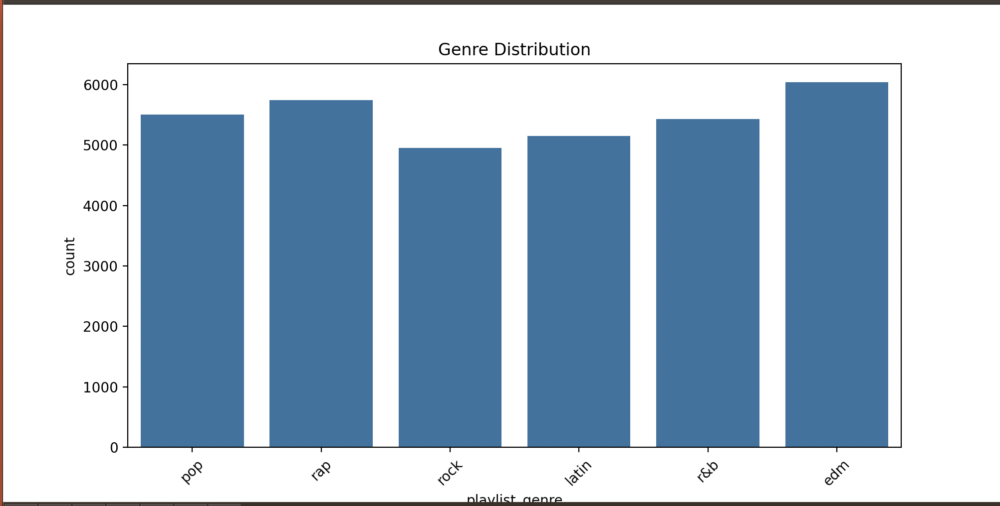
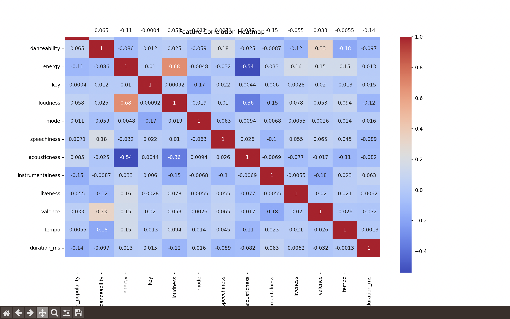
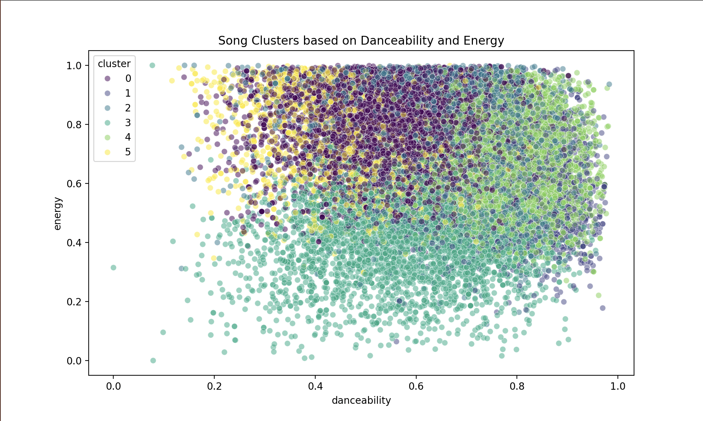
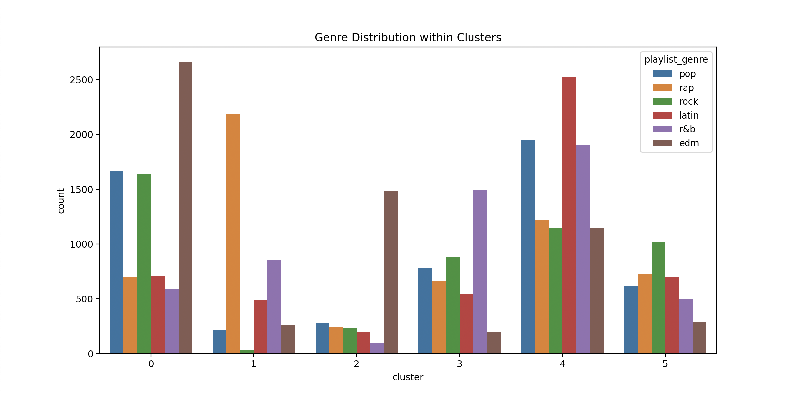

# 🎵 Spotify Songs: Genre Segmentation & Clustering
**Project Submission for AI/ML Course** **Student Name:** Lakshay Yadav  
**Submission Date:** March 16, 2026

---

## 📌 Project Overview
This project uses **Unsupervised Machine Learning (K-Means Clustering)** to group 32,000+ songs based on their acoustic "DNA." Instead of just looking at genres, the AI looks at features like how loud, fast, or danceable a song is to find hidden similarities.

---

## 🛠️ How it Works (Simple Explanation)
1. **Cleaning:** I removed any songs with missing data so the AI doesn't get confused.
2. **Scaling:** I made all the numbers (like tempo and energy) equal in importance so the AI doesn't prioritize bigger numbers.
3. **Clustering:** I used the **K-Means algorithm** to create 6 groups (clusters) of similar songs.
4. **Analysis:** I created graphs to prove that the AI actually found patterns.

---

## 📊 Visual Insights (From my Analysis)

### 1. Genre Distribution
This shows how many songs we have for each category. It helps us see if our data is balanced.

### 2. Feature Correlation Matrix
This heatmap shows which features "travel together." For example, if a song is loud, it's almost always high energy.

### 3. AI Cluster Visualization
This is the most important part. It shows the 6 groups the AI created. You can see how the songs are physically grouped into different "neighborhoods."

### 4. Genre vs. Cluster Mapping
This proves the AI works. It shows which official genres ended up in which AI clusters.

---

## ✅ Final Result
The project generated a new file: `spotify_clustered_results.csv`.  
This file can now be used to build a **Recommendation System**. If a user likes a song in Cluster 2, we can suggest other songs from the same cluster because we know they sound similar.

---

## 📁 Folder Structure
- **data/**: Contains the original `spotify_songs.csv`.
- **plots/**: Contains the 4 images shown above (`graph1.png` to `graph4.png`).
- **spotify_project.py**: The main Python code.
- **spotify_clustered_results.csv**: The final output file.
- **README.md**: This documentation.
